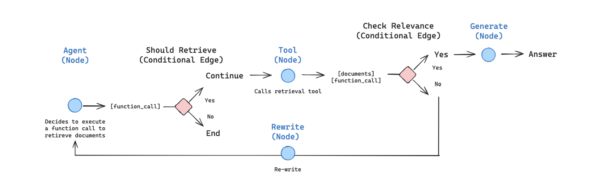
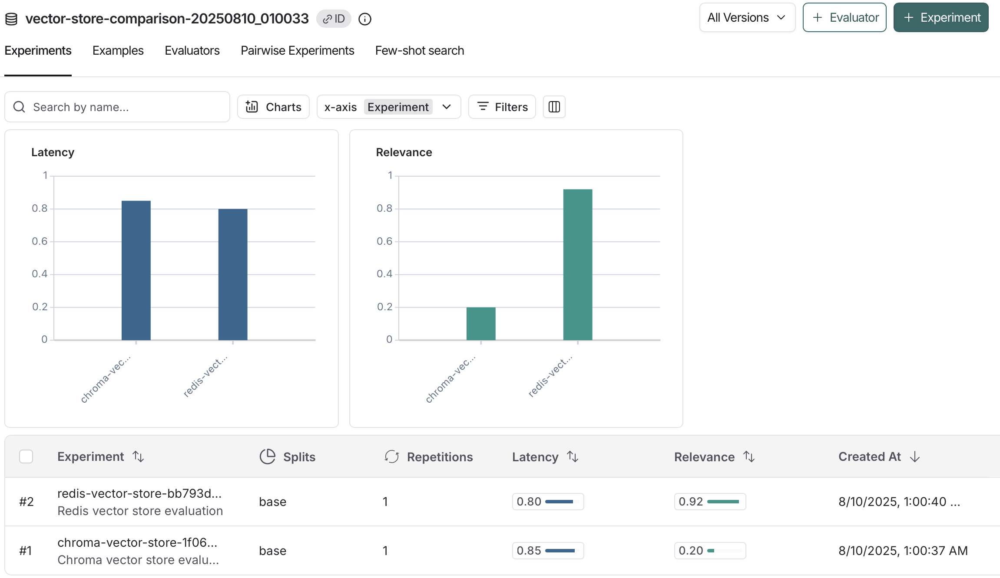
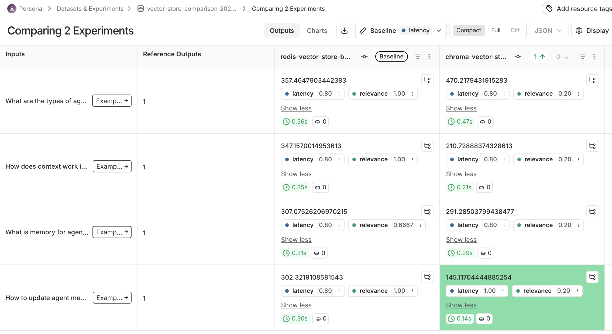

# Agentic RAG with Redis Vector Store

A sophisticated Retrieval-Augmented Generation (RAG) system built with LangGraph that leverages Redis as a high-performance vector store and includes comprehensive evaluation using LangSmith.

## 🏗️ Architecture Overview

This project implements an agentic RAG system that intelligently decides when to retrieve information, evaluates document relevance, and can rewrite queries for better results. The system uses Redis for fast vector similarity search and LangSmith for comprehensive evaluation and monitoring.

## 📁 Project Structure

```
agentic-RAG-Redis/
├── graph.py              # LangGraph workflow definition
├── nodes.py              # Agent node implementations
├── edges.py              # Conditional edge logic
├── state.py              # Agent state management
├── tools.py              # Retrieval tools
├── retriever.py          # Redis vector store setup
├── redis_connection.py   # Redis connection configuration
├── embedding.py          # Embedding utilities
├── working_langsmith_eval.py    # LangSmith evaluation framework
├── benchmark_comparison.py     # Performance benchmarking
├── quick_benchmark.py          # Quick performance tests
└── .env                       # Environment variables
```
## 🤖 LangGraph Agent Structure

### Agent Workflow

The agentic RAG system is built using LangGraph with the following node structure:



### Core Components

#### 1. **Agent Node** (`nodes.py`)
- **Purpose**: Entry point that decides whether to retrieve information or end the process
- **Functionality**: Uses OpenAI's function calling to determine if retrieval is needed
- **Decision Logic**: Analyzes the user query and decides on the next action

#### 2. **Retrieve Node** (`nodes.py`)
- **Purpose**: Executes document retrieval using the Redis vector store
- **Process**: Performs similarity search and returns relevant documents
- **Integration**: Uses the configured retriever tool for document fetching

#### 3. **Generate Node** (`nodes.py`)
- **Purpose**: Generates the final answer using retrieved context
- **Implementation**: Uses RAG prompt template with LLM to synthesize response
- **Context Integration**: Combines user question with retrieved documents

#### 4. **Rewrite Node** (`nodes.py`)
- **Purpose**: Transforms poorly performing queries for better retrieval
- **Strategy**: Analyzes semantic intent and reformulates the question
- **Loop Back**: Returns to agent node for re-evaluation


This design allows for:
- **Message History**: Maintains conversation context
- **State Persistence**: Tracks the flow through different nodes
- **Incremental Updates**: Adds new messages without losing history

## 🚀 Redis-Improved Retrieval

### Why Redis?

Redis provides significant advantages over traditional vector databases:

1. **Performance**: In-memory storage for sub-millisecond query times
2. **Scalability**: Horizontal scaling with Redis Cluster
3. **Flexibility**: Supports multiple data types and search patterns
4. **Reliability**: Built-in persistence and high availability

### Redis Integration

#### Vector Store Setup (`retriever.py`)

```python
from langchain_redis import RedisVectorStore
from langchain_openai import OpenAIEmbeddings

vectorstore = RedisVectorStore(
    redis_url=REDIS_URL,
    index_name="rag-redis-index",
    embeddings=OpenAIEmbeddings(),
)

retriever = vectorstore.as_retriever(
    search_type="similarity",
    search_kwargs={"k": 2}
)
```

#### Connection Configuration (`redis_connection.py`)

The system supports both local and cloud Redis instances:

```python
REDIS_HOST = os.getenv("REDIS_HOST", "localhost")
REDIS_PORT = os.getenv("REDIS_PORT", "6379")
REDIS_PASSWORD = os.getenv("REDIS_PASSWORD", "")
REDIS_URL = f"redis://:{REDIS_PASSWORD}@{REDIS_HOST}:{REDIS_PORT}"
```

### Performance Benefits

Based on our benchmarking (`benchmark_comparison.py`), Redis provides:

- **Lower Latency**: Faster query response times
- **Better Throughput**: Higher concurrent query handling
- **Memory Efficiency**: Optimized memory usage patterns
- **Consistent Performance**: Stable response times under load

### Search Capabilities

Redis vector store supports:
- **Similarity Search**: Cosine similarity for semantic matching
- **Hybrid Search**: Combining vector and text search
- **Filtering**: Metadata-based document filtering
- **Batch Operations**: Efficient bulk document processing

## 📊 LangSmith Evaluator Integration





### Evaluation Framework

The system includes comprehensive evaluation using LangSmith (`working_langsmith_eval.py`):

#### 1. **Dataset Creation**
```python
def create_langsmith_dataset(self) -> str:
    """Create LangSmith dataset for evaluation"""
    dataset_name = f"vector-store-comparison-{datetime.now().strftime('%Y%m%d_%H%M%S')}"
    
    # Create dataset with test queries and expected outputs
    dataset = self.client.create_dataset(
        dataset_name=dataset_name,
        description="Vector store comparison dataset for Chroma vs Redis"
    )
```

#### 2. **Custom Evaluators**

**Relevance Evaluator**:
```python
def relevance_evaluator(self, run, example):
    """Evaluates the relevance of retrieved documents"""
    # Analyzes document content against query
    # Returns relevance score and reasoning
```

**Latency Evaluator**:
```python
def latency_evaluator(self, run, example):
    """Evaluates query response time performance"""
    # Measures and grades response latency
    # Categories: Excellent (<200ms), Good (<500ms), Fair (<1000ms), Poor (≥1000ms)
```

#### 3. **Evaluation Metrics**

The system tracks:
- **Relevance Score**: Document relevance to queries
- **Latency**: Query response time
- **Success Rate**: Query completion rate
- **Error Rate**: Failed query percentage
- **Memory Usage**: System resource consumption

### LangSmith Integration Benefits

1. **Tracing**: Complete visibility into agent decision-making
2. **Debugging**: Detailed logs for troubleshooting
3. **Monitoring**: Real-time performance tracking
4. **Comparison**: Side-by-side evaluation of different configurations
5. **Analytics**: Historical performance trends

### Evaluation Results

The evaluation framework provides:
- **Automated Testing**: Consistent evaluation across configurations
- **Performance Benchmarking**: Quantitative comparison metrics
- **Quality Assessment**: Relevance and accuracy scoring
- **Resource Monitoring**: Memory and CPU usage tracking

## 🛠️ Setup and Installation

### Prerequisites

- Python 3.8+
- Redis server (local or cloud)
- OpenAI API key
- LangSmith API key (for evaluation)

### Environment Variables

Create a `.env` file with:

```env
OPENAI_API_KEY=your_openai_api_key
LANGSMITH_API_KEY=your_langsmith_api_key
REDIS_HOST=localhost
REDIS_PORT=6379
REDIS_PASSWORD=
REDIS_URL=redis://localhost:6379
```

### Installation

```bash
# Clone the repository
git clone <repository-url>
cd agentic-RAG-Redis

# Create virtual environment
python -m venv .venv
source .venv/bin/activate  # On Windows: .venv\Scripts\activate

# Install dependencies
pip install -r requirements.txt

# Start Redis server (if running locally)
redis-server
```

## 🚀 Usage

### Running the Agent

```python
from graph import app
from langchain_core.messages import HumanMessage

# Create input
inputs = {
    "messages": [
        HumanMessage(content="What are the types of agent memory?")
    ]
}

# Run the agent
for output in app.stream(inputs, stream_mode="values"):
    print(output)
```

### Running Evaluations

```bash
# Run LangSmith evaluation
python working_langsmith_eval.py

# Run performance benchmarks
python benchmark_comparison.py

# Quick performance test
python quick_benchmark.py
```

## 📈 Performance Metrics

### Benchmark Results

Our comprehensive benchmarking shows Redis advantages:

- **Average Latency**: Consistently lower query response times
- **P95/P99 Latency**: Better tail latency performance
- **Concurrent Load**: Superior performance under load
- **Memory Efficiency**: Optimized resource utilization

### Evaluation Insights

LangSmith evaluation reveals:
- **Retrieval Quality**: High relevance scores for retrieved documents
- **Agent Decision Making**: Effective routing and query rewriting
- **End-to-End Performance**: Complete workflow optimization

## 🔧 Configuration

### Redis Configuration

Customize Redis settings in `redis_connection.py`:
- Connection parameters
- Index configuration
- Search parameters

### Agent Configuration

Modify agent behavior in:
- `nodes.py`: Node implementations
- `edges.py`: Decision logic
- `tools.py`: Retrieval tools

## 📊 Monitoring and Observability

### LangSmith Dashboard

Access detailed metrics at: https://smith.langchain.com/

Features:
- Real-time tracing
- Performance analytics
- Error tracking
- Comparative analysis

### Local Monitoring

Use the benchmark tools for:
- Performance profiling
- Resource monitoring
- Load testing
- Regression detection

## 🤝 Contributing

1. Fork the repository
2. Create a feature branch
3. Make your changes
4. Run tests and benchmarks
5. Submit a pull request

## 📝 License

[Add your license information here]

## 🙏 Acknowledgments

- LangChain team for the excellent framework
- Redis team for the high-performance vector store
- LangSmith team for evaluation and monitoring tools

---

*This README will be updated with screenshots from LangSmith and workflow diagrams as they become available.*
